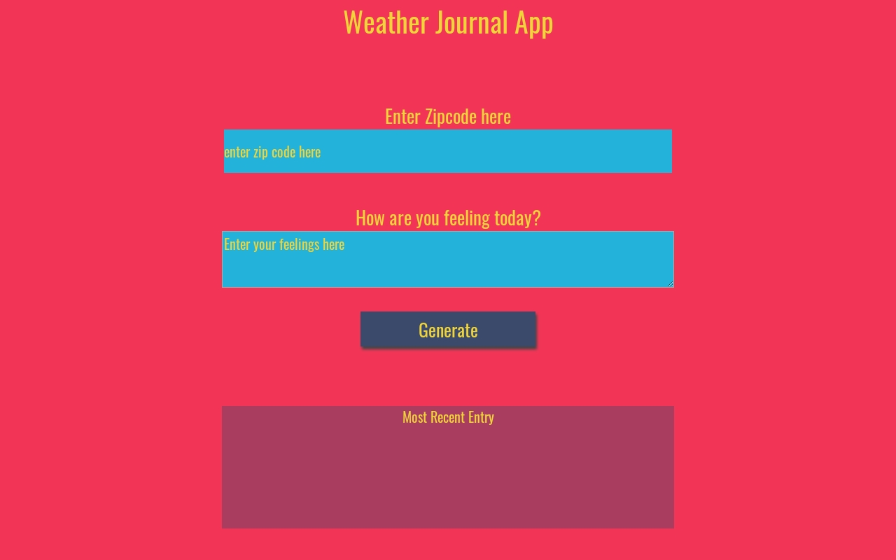

# Weather-Journal App Project

> This project showcases an asynchronous web app that uses Web API and user data to dynamically update the UI using pure HTML, CSS, Javascript as well as an Express backend server.


## Weather-Journal App



Visit the website [here](https://thepembeweb.github.io/weather-journal-app/website/index.html)

## Installation

### Setup

Clone the source locally:

```sh
$ git clone https://github.com/thepembeweb/weather-journal-app.git
$ cd weather-journal-app
```
If you're on Debian or Ubuntu, you'll also need to install
`nodejs-legacy`:

Use your package manager to install `npm`.

```sh
$ sudo apt-get install npm nodejs-legacy
```

Install project dependencies:

```sh
$ npm install
```
Navigate to the website folder and open the index.html file in your browser to run the website.

Alternatively you can view the website [here](https://thepembeweb.github.io/weather-journal-app/website/index.html).

## Built With

* [HTML](https://en.wikipedia.org/wiki/HTML) - The markup language used
* [CSS](https://en.wikipedia.org/wiki/Cascading_Style_Sheets) - The style sheet language used
* [Javascript](https://en.wikipedia.org/wiki/JavaScript) - The programming language used
* [Node.js®](https://nodejs.org/) - The JavaScript runtime used
* [Express.js®](https://nodejs.org/) - The web application framework used
* [OpenWeatherMap API](https://openweathermap.org/api/) - The Weather API used

## Authors

* **[Pemberai Sweto](https://github.com/thepembeweb)** - *Initial work* - [Weather-Journal App Project](https://github.com/thepembeweb/weather-journal-app)

## License

[](http://badges.mit-license.org)

- This project is licensed under the MIT License - see the [LICENSE.md](LICENSE.md) file for details
- Copyright 2020 © [Pemberai Sweto](https://github.com/thepembeweb).


